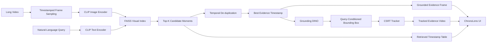

<div align="center">

# ChronoLens

### Long-Video Retrieval · Temporal Localization · Visual Evidence Tracking

**Search video with natural language, retrieve the right moment, ground the evidence, and track it through time.**

[](https://www.python.org/)
[](https://pytorch.org/)
[](https://huggingface.co/docs/transformers/)
[](https://github.com/facebookresearch/faiss)
[](https://www.gradio.app/)
[](#project-status)

</div>

---

<p align="center">
  
</p>

<p align="center">
  <sub><b>ChronoLens UI:</b> index a video, ask a natural-language question, choose a visual target, and investigate the retrieved moment.</sub>
</p>

---

## Why ChronoLens?

Searching a long video should not require manually scrubbing through a timeline or repeatedly sending the entire video to a large multimodal model.

ChronoLens uses a **hierarchical video investigation pipeline**:

```text
Natural-language query
        │
        ▼
CLIP semantic retrieval
        │
        ▼
FAISS top-K timestamp search
        │
        ▼
Best candidate moment
        │
        ▼
Grounding DINO visual grounding
        │
        ▼
CSRT evidence tracking
        │
        ▼
Grounded frame + tracked clip + ranked timestamps
```

The key idea is simple:

> **Retrieve broadly, inspect locally, and return visible evidence.**

Instead of performing expensive visual reasoning over every frame, ChronoLens first narrows the search to relevant moments and then applies object-centric grounding and tracking only where it matters.

---

## Real-World Demo

### Query

```text
find people riding bicycles
```

### Visual target

```text
bicycle
```

<p align="center">
  
</p>

<p align="center">
  <sub><b>Real-world output:</b> semantic retrieval → open-vocabulary grounding → evidence tracking.</sub>
</p>

### Example output from this run

| Signal | Result |
| --- | ---: |
| Best retrieved timestamp | **32.0 s** |
| Retrieval similarity | **0.2726** |
| Detected object | **bicycle** |
| Detection confidence | **0.7273** |
| Tracked frames | **120** |
| Failed tracking frames | **0** |

> These values document one qualitative real-world demonstration. They are **not benchmark scores**.

---

## What ChronoLens Can Do

### Semantic video retrieval

- sample timestamped video frames
- encode frames with **CLIP**
- encode natural-language queries with the same vision-language embedding space
- build a **FAISS** visual index
- return top matching timestamps
- suppress near-duplicate temporal results

### Visual evidence grounding

- take the highest-ranked moment
- use **Grounding DINO** for open-vocabulary localization
- ground a user-specified visual target such as `bicycle`, `backpack`, or `person`
- render labeled evidence boxes and confidence scores

### Evidence tracking

- initialize an **OpenCV CSRT** tracker from the grounded detection
- track the target across subsequent frames
- render the tracked bounding box, label, confidence, and center point
- export a browser-playable H.264 evidence clip

### Interactive investigation

The Gradio interface supports:

- video upload
- configurable indexing interval
- natural-language search
- visual-target specification
- adjustable tracking duration
- grounded evidence preview
- tracked evidence playback
- ranked timestamp table
- structured JSON investigation summary

---

## Architecture



---

## End-to-End Flow

```text
Video
  │
  ├─► probe metadata
  │
  ├─► sample frames every N seconds
  │
  ├─► CLIP image embeddings
  │
  └─► FAISS index
             ▲
             │
Query ─► CLIP text embedding
             │
             ▼
        Top-K moments
             │
             ▼
      Temporal filtering
             │
             ▼
        Best timestamp
             │
             ▼
      Grounding DINO
             │
             ▼
      Visual evidence
             │
             ▼
        CSRT tracking
             │
             ▼
Evidence image + tracked clip + ranked results + JSON summary
```

---

## Model & System Stack

| Stage | Technology | Role |
| --- | --- | --- |
| Video I/O | OpenCV | decoding, frame access, metadata |
| Video encoding | FFmpeg via `imageio-ffmpeg` | H.264 output |
| Semantic retrieval | `openai/clip-vit-base-patch32` | image/text embeddings |
| Vector search | FAISS | nearest-neighbor retrieval |
| Visual grounding | `IDEA-Research/grounding-dino-tiny` | open-vocabulary object localization |
| Tracking | OpenCV CSRT | frame-to-frame evidence tracking |
| Deep learning | PyTorch | GPU execution |
| Model loading | Hugging Face Transformers | CLIP + Grounding DINO |
| Interface | Gradio | interactive demo |
| Development GPU | NVIDIA A100-SXM4-80GB | model inference / experiments |

---

## Repository Structure

```text
ChronoLens/
├── app.py
├── pyproject.toml
├── README.md
│
├── src/
│   └── chronolens/
│       ├── __init__.py
│       ├── video.py
│       ├── retrieval.py
│       ├── evidence.py
│       ├── tracking.py
│       ├── pipeline.py
│       ├── media.py
│       └── engine.py
│
├── scripts/
│   ├── smoke_test.py
│   ├── e2e_test.py
│   └── make_demo_video.py
│
├── tests/
│   └── test_media.py
│
├── assets/
├── configs/
├── data/
├── outputs/
│
└── .github/
    └── workflows/
        └── ci.yml
```

---

# Quick Start

## 1. Clone

```bash
git clone git@github.com:Delimiter-Ashish/ChronoLens.git
cd ChronoLens
```

HTTPS also works:

```bash
git clone https://github.com/Delimiter-Ashish/ChronoLens.git
cd ChronoLens
```

## 2. Create the environment

```bash
python3 -m venv Chronolens
source Chronolens/bin/activate
python -m pip install --upgrade pip
```

## 3. Install PyTorch

Install a PyTorch build appropriate for your CUDA environment.

The BU SCC setup used during development was:

```bash
python -m pip install torch torchvision \
  --index-url https://download.pytorch.org/whl/cu130
```

## 4. Install ChronoLens

```bash
python -m pip install -e ".[dev]"
```

## 5. Keep Hugging Face models inside the project

```bash
export HF_HOME="$PWD/.cache/huggingface"
export HUGGINGFACE_HUB_CACHE="$HF_HOME/hub"
export HF_TOKEN_PATH="$HF_HOME/token"
unset TRANSFORMERS_CACHE
```

## 6. Launch

```bash
python app.py
```

ChronoLens launches Gradio on port `7860` and requests a temporary public share link.

You should see output similar to:

```text
Running on local URL:  http://0.0.0.0:7860
Running on public URL: https://xxxxxxxx.gradio.live
```

Open the `gradio.live` URL in your browser.

---

# Running on Boston University SCC

ChronoLens was developed and tested on the **Boston University Shared Computing Cluster (SCC)**.

## 1. Start a GPU-enabled OnDemand session

From BU SCC OnDemand:

1. start a GPU-capable interactive session
2. launch JupyterLab
3. open a terminal

## 2. Enter the project

```bash
cd /projectnb/medaihack/team4/Ashish-ChronoLens
```

## 3. Activate the existing environment

```bash
source Chronolens/bin/activate
```

## 4. Configure local model storage

```bash
export HF_HOME="$PWD/.cache/huggingface"
export HUGGINGFACE_HUB_CACHE="$HF_HOME/hub"
export HF_TOKEN_PATH="$HF_HOME/token"
unset TRANSFORMERS_CACHE
```

This keeps Hugging Face model files under the ChronoLens project instead of writing them into unrelated SCC storage locations.

## 5. Verify the GPU before launching

```bash
python - <<'PY'
import torch

print("CUDA available:", torch.cuda.is_available())
print("GPU count:", torch.cuda.device_count())

if torch.cuda.is_available():
    print("GPU:", torch.cuda.get_device_name(0))
    x = torch.zeros((100, 100), device="cuda:0")
    print("CUDA tensor test: PASS", x.device)
PY
```

Expected output on the tested SCC setup:

```text
CUDA available: True
GPU count: 1
GPU: NVIDIA A100-SXM4-80GB
CUDA tensor test: PASS cuda:0
```

## 6. Launch ChronoLens

```bash
python app.py
```

Open the generated:

```text
https://xxxxxxxx.gradio.live
```

URL in your browser.

## 7. Run an investigation

Upload a video and either:

- click **Build Video Index**, then investigate, or
- enter a query directly; the current UI automatically builds an index if the uploaded video has not yet been indexed

Example:

```text
Natural-language query:
find people riding bicycles

Visual target:
bicycle

Tracking duration:
4 seconds
```

ChronoLens returns:

- grounded evidence frame
- tracked evidence video
- top-5 retrieved timestamps
- CLIP similarity scores
- object detection confidence
- tracked / failed frame counts
- structured JSON summary

## 8. Stop cleanly

Use:

```text
Ctrl+C
```

Avoid `Ctrl+Z` for the running Gradio process. `Ctrl+Z` suspends rather than terminates the process and can leave a GPU context alive.

---

## Using the Interface

### Step 1 — Upload a video

Use the video panel to upload an MP4.

For reliable browser playback, H.264 MP4 is recommended.

### Step 2 — Choose the sampling interval

The default is:

```text
1.0 second
```

Smaller intervals provide denser temporal coverage but increase indexing cost.

### Step 3 — Build the index

Click:

```text
⚡ Build Video Index
```

ChronoLens:

1. probes the video
2. samples timestamped frames
3. computes CLIP embeddings on the GPU
4. stores the embeddings in FAISS

### Step 4 — Ask a natural-language question

Example:

```text
find the man walking with a backpack
```

### Step 5 — Specify what should be visually grounded

Example:

```text
backpack
```

The retrieval query and visual target are intentionally separate:

- the **query** describes the event or scene to retrieve
- the **visual target** specifies the object/person to localize and track

### Step 6 — Investigate

Click:

```text
🔎 Investigate
```

ChronoLens performs:

```text
semantic retrieval
→ temporal candidate selection
→ visual grounding
→ object tracking
→ evidence generation
```

---

## Programmatic Pipeline

The main orchestration class is:

```python
from chronolens.pipeline import ChronoLensPipeline
```

Example:

```python
from chronolens.pipeline import ChronoLensPipeline

pipeline = ChronoLensPipeline()

pipeline.index_video(
    video_path="video.mp4",
    sample_every=1.0,
    batch_size=16,
)

result = pipeline.investigate(
    query="find people riding bicycles",
    evidence_prompt="bicycle",
    tracking_duration=4.0,
    top_k=5,
)

print(result["best_timestamp"])
print(result["retrieval_score"])
print(result["detection"])
print(result["tracking_video"])
```

Generated investigation artifacts are written under:

```text
outputs/investigations/<query-slug>/
├── evidence.jpg
├── tracking.mp4
└── result.json
```

---

## Validation

### Controlled systems test

A synthetic systems-test video was used to validate each module independently.

Example query:

```text
black backpack
```

Observed behavior in the controlled test:

- relevant event retrieved around **13 s**
- Grounding DINO localized the backpack
- detection confidence approximately **0.84**
- object tracked for **120 frames**
- **0 failed tracking frames**

### Real-world investigation

The real-world bicycle example shown above produced:

```json
{
  "query": "find people riding bicycles",
  "best_timestamp": 32.0,
  "retrieval_score": 0.2726,
  "detected_object": "bicycle",
  "detection_score": 0.7273,
  "tracked_frames": 120,
  "failed_frames": 0
}
```

These examples demonstrate end-to-end functionality. They are not intended to replace evaluation on a public temporal-grounding benchmark.

---

## Tests

Run the unit tests:

```bash
pytest -q
```

Run the environment smoke test:

```bash
python scripts/smoke_test.py
```

A synthetic demo video can be generated with:

```bash
python scripts/make_demo_video.py
```

The repository also includes an end-to-end test harness:

```bash
python scripts/e2e_test.py
```

The E2E test may download model weights on the first run.

---

## Design Decisions

### Why CLIP + FAISS?

CLIP gives ChronoLens a shared image-text embedding space, which allows natural-language queries to retrieve semantically related video frames without requiring custom training.

FAISS provides a simple and efficient vector-search layer over the indexed frame embeddings.

### Why not send the whole video to a VLM?

For long video, brute-force multimodal inference quickly becomes expensive.

ChronoLens instead narrows the search space first:

```text
whole video
   ↓
semantic candidates
   ↓
best moments
   ↓
expensive visual inspection only where needed
```

### Why Grounding DINO?

Retrieval tells the system **when** something relevant may happen.

Grounding DINO provides visible evidence of **where** the requested object appears in that moment.

### Why tracking after detection?

A single grounded frame is useful, but a tracked clip provides stronger visual evidence that the localized target persists and moves through time.

---

## Research Direction

ChronoLens is motivated by the research question:

> **Can hierarchical retrieval plus object-centric visual evidence improve long-video event localization while reducing unnecessary multimodal computation?**

Planned evaluation directions include:

- retrieval-only baseline
- retrieval + grounding
- retrieval + temporal refinement
- retrieval + VLM reranking
- object-evidence-assisted reranking
- latency vs. retrieval-quality trade-offs
- public temporal-grounding benchmarks

Potential metrics:

- Recall@1
- Recall@5
- mAP
- temporal IoU
- R@1 at IoU thresholds
- indexing throughput
- query latency

---

## Current Limitations

ChronoLens v0.1 is a working research prototype, not a finished production system.

Current limitations include:

- temporal localization resolution depends on the frame-sampling interval
- retrieval is currently image-centric and does not use audio
- the visual target is provided separately from the natural-language event query
- CSRT tracks one initialized target and can drift under severe occlusion or large appearance changes
- Grounding DINO may fail when the requested target is ambiguous or visually weak
- FAISS indexes are currently rebuilt by the running pipeline rather than managed as a persistent multi-video library
- no public temporal-grounding benchmark results are claimed yet
- Gradio share URLs are temporary

---

## Roadmap

### v0.1 — Working end-to-end prototype

- [x] video ingestion
- [x] timestamped frame sampling
- [x] CLIP image indexing
- [x] CLIP natural-language retrieval
- [x] FAISS top-K search
- [x] temporal duplicate suppression
- [x] Grounding DINO evidence localization
- [x] CSRT evidence tracking
- [x] H.264 tracked-evidence export
- [x] Gradio investigation UI
- [x] controlled systems-test validation
- [x] real-world bicycle investigation

### v0.2 — Stronger multimodal evidence

- [ ] clickable timestamp results
- [ ] result-specific video clips
- [ ] event timeline visualization
- [ ] evidence thumbnail strip
- [ ] SAM2 mask-based video tracking
- [ ] VLM candidate reranking
- [ ] timestamp refinement inside retrieved windows
- [ ] Whisper transcript indexing
- [ ] audio + visual retrieval fusion

### Research evaluation

- [ ] select an existing temporal-grounding benchmark
- [ ] retrieval-only baseline
- [ ] grounding-assisted ablation
- [ ] VLM reranking ablation
- [ ] latency profiling
- [ ] indexing-throughput analysis
- [ ] temporal IoU evaluation

---

## Project Status

**ChronoLens v0.1 is a working end-to-end research prototype.**

Current validated path:

```text
video
→ timestamped sampling
→ CLIP embedding index
→ natural-language retrieval
→ top-K moments
→ Grounding DINO visual evidence
→ CSRT tracking
→ interactive investigation output
```

The current release prioritizes a clean, interpretable pipeline over adding every possible multimodal component at once.

---

## Author

**Ashish Joshi**  
M.S. Artificial Intelligence — Boston University

[GitHub: @Delimiter-Ashish](https://github.com/Delimiter-Ashish)

---

<div align="center">

### ChronoLens

**Search the video. Find the moment. Track the evidence.**

</div>
