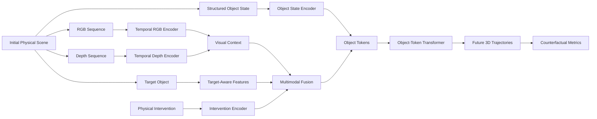
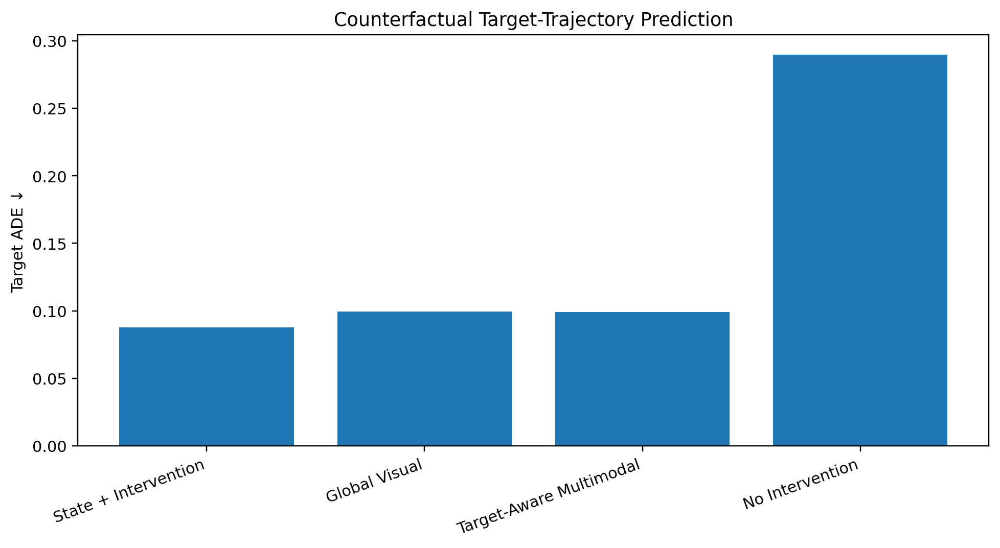
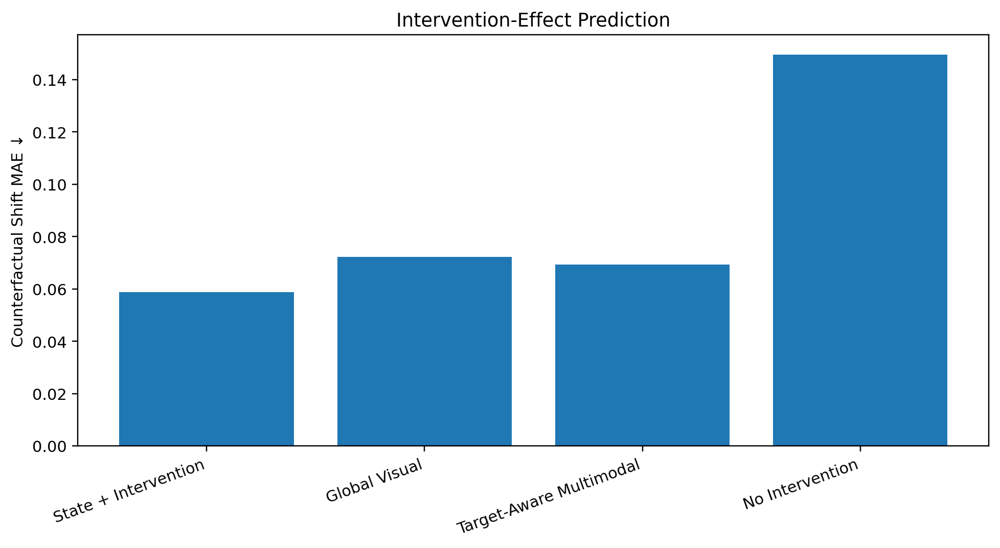
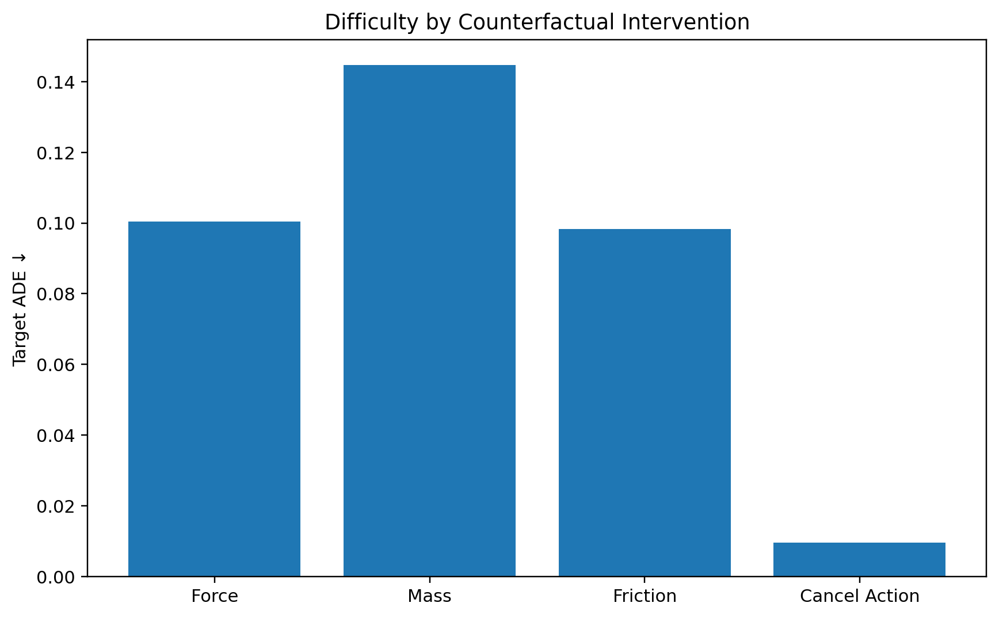
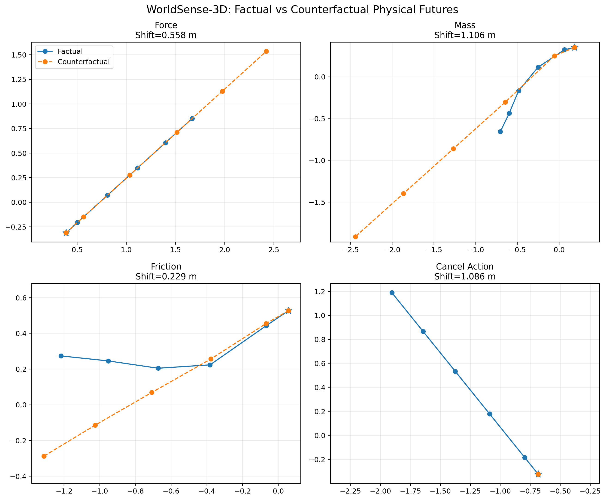

# WorldSense-3D

### Intervention-Aware Multisensor World Modeling for Counterfactual Physical AI

WorldSense-3D is a research-oriented physical world model for predicting how 3D scenes evolve under **factual and counterfactual interventions**.

Given the same initial physical scene, the system models alternative futures produced by changes in **force, mass, friction, or action execution**. It combines PyBullet simulation, structured object state, RGB, depth, segmentation, intervention conditioning, and object-token transformers for future 3D trajectory forecasting.

> **Core question:**  
> If an action or physical property changes, can a learned world model predict how the future changes?

---

## Overview

WorldSense-3D provides an end-to-end pipeline for:

- paired factual / counterfactual simulation
- RGB, depth, segmentation, and structured state sensing
- object-level future 3D trajectory prediction
- intervention-conditioned world modeling
- target-object reasoning
- counterfactual effect measurement
- modality ablations
- intervention-specific failure analysis
- reproducible training and evaluation

The current release contains a **5,000-pair counterfactual benchmark** with four intervention families.

---

## Counterfactual Physical Reasoning

For every sampled scene, WorldSense-3D can generate two futures from the same starting world:

```text
                     SAME INITIAL WORLD
                            │
                ┌───────────┴───────────┐
                │                       │
                ▼                       ▼
          Factual World          Counterfactual World
          original physics       modified intervention
                │                       │
                ▼                       ▼
         Future trajectory       Alternative future
                │                       │
                └───────────┬───────────┘
                            ▼
                  Counterfactual Effect
```

Supported counterfactual interventions:

| Intervention | Example |
|---|---|
| Force | weaker or stronger push |
| Mass | lighter or heavier target object |
| Friction | lower or higher target friction |
| Action cancellation | intended push does not occur |

---

## System Architecture



The architecture is intentionally modular so different sensor combinations can be evaluated independently.

---

## v0.2 Counterfactual Benchmark

The v0.2 benchmark contains:

- **5,000 paired factual/counterfactual scenes**
- **4,000 training pairs**
- **500 validation pairs**
- **500 test pairs**
- **3–5 rigid objects per scene**
- **4 context frames**
- **5 future prediction frames**
- randomized object mass, friction, restitution, and force
- four counterfactual intervention families

---

## Main Results

| Model | ADE ↓ | FDE ↓ | Target ADE ↓ | Target FDE ↓ | Shift MAE ↓ | Final Shift MAE ↓ |
|---|---:|---:|---:|---:|---:|---:|
| **State + Intervention** | **0.0361** | **0.0644** | **0.0878** | **0.1685** | **0.0588** | **0.1136** |
| Global Visual + State + Intervention | 0.0392 | 0.0713 | 0.0994 | 0.1912 | 0.0722 | 0.1388 |
| Target-Aware Multimodal | 0.0399 | 0.0750 | 0.0991 | 0.1925 | 0.0693 | 0.1330 |
| No Intervention Conditioning | 0.0848 | 0.1483 | 0.2898 | 0.5038 | 0.1495 | 0.2527 |

### Key Findings

**1. Explicit intervention conditioning is critical.**

Compared with the no-intervention model, the strongest intervention-aware configuration reduces:

- **Target ADE by ~69.7%**
- **Counterfactual Shift MAE by ~60.7%**

**2. Structured physical state is extremely strong in this simulator.**

State + intervention conditioning achieves the strongest overall benchmark performance.

**3. RGB and depth do not outperform privileged structured state in the current setting.**

This is an important negative result rather than something hidden by the benchmark. When precise object position, orientation, velocity, and intervention information are already available, visual sensing is largely redundant under the current synthetic setup.

This motivates a harder next-stage problem:

> Can visual perception recover physical information when structured state is incomplete, noisy, or unavailable?

**4. Mass interventions are the hardest tested counterfactual family.**

Changes to latent physical properties such as mass are substantially harder than action cancellation.

---

## Benchmark Visualizations

### Counterfactual Target Prediction



### Intervention-Effect Prediction



### Intervention Difficulty



Detailed benchmark analysis is available in:

[`docs/V0.2_RESULTS.md`](docs/V0.2_RESULTS.md)

---

## Qualitative Counterfactual Futures

WorldSense-3D also generates matched qualitative examples where the initial world is unchanged but one physical intervention is modified.



Additional trajectory plots and factual-vs-counterfactual animations are available under:

[`docs/figures/counterfactual_examples/`](docs/figures/counterfactual_examples/)

---

## Metrics

### ADE — Average Displacement Error

Average 3D trajectory error across all predicted future frames.

### FDE — Final Displacement Error

3D trajectory error at the final prediction frame.

### Target ADE / FDE

ADE and FDE computed specifically for the directly intervened object.

### Shift MAE

Error in the predicted magnitude of the trajectory change caused by the counterfactual intervention.

### Final Shift MAE

Counterfactual effect error at the final prediction frame.

---

## Dataset Structure

Each factual/counterfactual pair contains:

- RGB sequence
- metric depth sequence
- semantic segmentation
- structured object states
- object-validity mask
- target object index
- factual action
- counterfactual action
- target mass
- target friction
- effective force
- intervention type
- intervention scale
- factual future trajectories
- counterfactual future trajectories

Structured object state includes:

```text
3D position
orientation quaternion
linear velocity
angular velocity
```

---

## Quick Start

### 1. Clone

```bash
git clone https://github.com/Delimiter-Ashish/WorldSense-3D-Multisensor-World-Model-for-Physical-AI.git
cd WorldSense-3D-Multisensor-World-Model-for-Physical-AI
```

### 2. Create environment

```bash
python -m venv .venv
source .venv/bin/activate

pip install -e ".[dev]"
```

### 3. Run tests

```bash
pytest -q
```

### 4. Generate counterfactual data

```bash
python scripts/generate_counterfactual_dataset.py \
    --config configs/counterfactual.yaml \
    --pairs 5000
```

### 5. Train the counterfactual world model

```bash
python scripts/train_counterfactual.py \
    --config configs/counterfactual_5000.yaml
```

### 6. Evaluate

```bash
python scripts/evaluate_counterfactual.py \
    --checkpoint outputs/counterfactual_5000/best.pt \
    --split test \
    --batch-size 128
```

---

## Repository Structure

```text
WorldSense-3D/
│
├── configs/
│   ├── base.yaml
│   ├── counterfactual.yaml
│   ├── counterfactual_5000.yaml
│   └── ablation configurations
│
├── src/worldsense3d/
│   ├── sim/
│   │   ├── generator.py
│   │   └── counterfactual.py
│   │
│   ├── data/
│   │   ├── dataset.py
│   │   └── counterfactual_dataset.py
│   │
│   ├── models/
│   │   ├── encoders.py
│   │   ├── world_model.py
│   │   └── counterfactual_world_model.py
│   │
│   ├── train.py
│   ├── train_counterfactual.py
│   ├── evaluate.py
│   └── metrics.py
│
├── scripts/
│   ├── generate_dataset.py
│   ├── generate_counterfactual_dataset.py
│   ├── train_counterfactual.py
│   ├── evaluate_counterfactual.py
│   └── visualization scripts
│
├── results/
│   ├── v0.1_results.json
│   └── v0.2_ablation_results.json
│
├── docs/
│   ├── EXPERIMENTS.md
│   ├── V0.2_RESULTS.md
│   ├── ROADMAP.md
│   └── figures/
│
├── tests/
├── slurm/
├── requirements.txt
├── pyproject.toml
└── README.md
```

---

## Research Questions

WorldSense-3D is designed to study:

1. Can learned world models predict alternative physical futures?
2. How important is explicit intervention conditioning?
3. Which physical properties are hardest to reason about counterfactually?
4. When does visual sensing provide information beyond structured state?
5. Can hidden physical properties be inferred directly from perception?
6. How robust are predictions to missing or corrupted sensors?
7. Can a VLM use a learned physical dynamics model as a reasoning tool?

---

## Current Limitations

The current benchmark intentionally uses a controlled synthetic environment.

Important limitations include:

- PyBullet-only simulation
- small numbers of rigid objects
- privileged structured object state
- limited visual diversity
- fixed camera configuration
- no real-world sensor noise
- no language-conditioned reasoning yet
- no embodied planning loop

These limitations define the next research direction rather than being hidden by the evaluation.

---

## Future Work

Planned extensions include:

- vision-only physical forecasting
- partial and noisy state estimation
- hidden mass/friction inference
- object-centric visual representation learning
- contact and collision prediction
- uncertainty-aware trajectory forecasting
- sensor dropout and corruption benchmarks
- natural-language physical reasoning
- VLM + world-model integration
- embodied-agent planning
- transfer from synthetic physics to real video

---

## Reproducibility

Benchmark numbers reported in this repository are tied to checked-in experiment configurations and recorded result files.

Large generated artifacts are intentionally excluded from Git:

- simulation datasets
- model checkpoints
- virtual environments
- raw training outputs

Tracked artifacts include:

- source code
- experiment configurations
- benchmark summaries
- tests
- analysis scripts
- figures
- documentation

---

## Version

Current research release:

**WorldSense-3D v0.2.0 — Counterfactual Physical World Modeling**

---

## License

MIT
